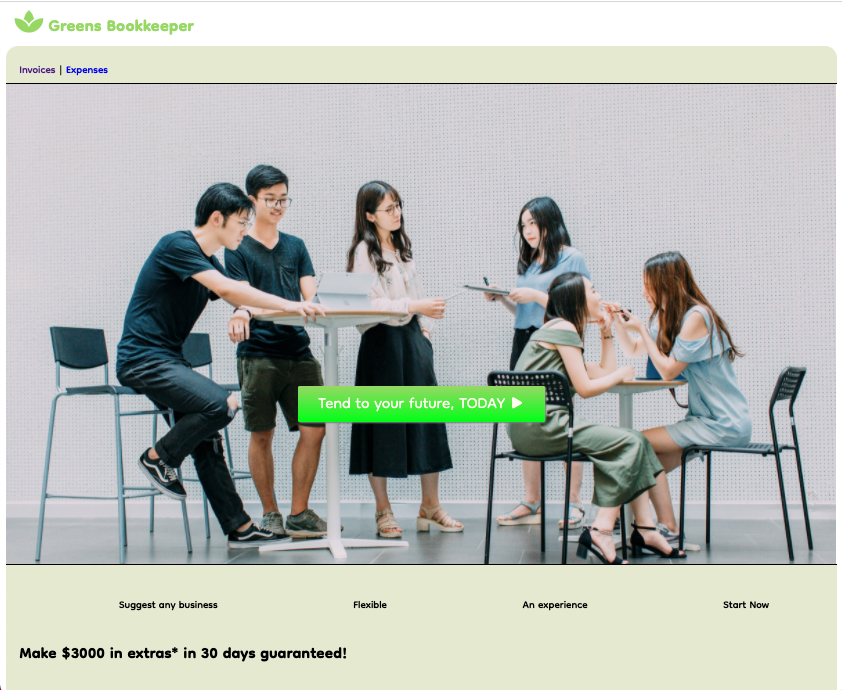

# Greens Bookkeeper App

This project was bootstrapped with [Create React App](https://github.com/facebook/create-react-app).

The Greens Bookkeeper App was created with the help of the React Router tutorial for learning React Router.

This app covers the following features:

- New styling updated by me!
- Configuring Routes
- Navigating with Link
- Creating Links with active styling
- Using Nested Routes for Layout
- Navigating programmatically
- Using URL params for data loading
- Using URL Search params
- Creating your own behaviours through composition
- Server Rendering
- Added Fonts Icon and Google Fonts
